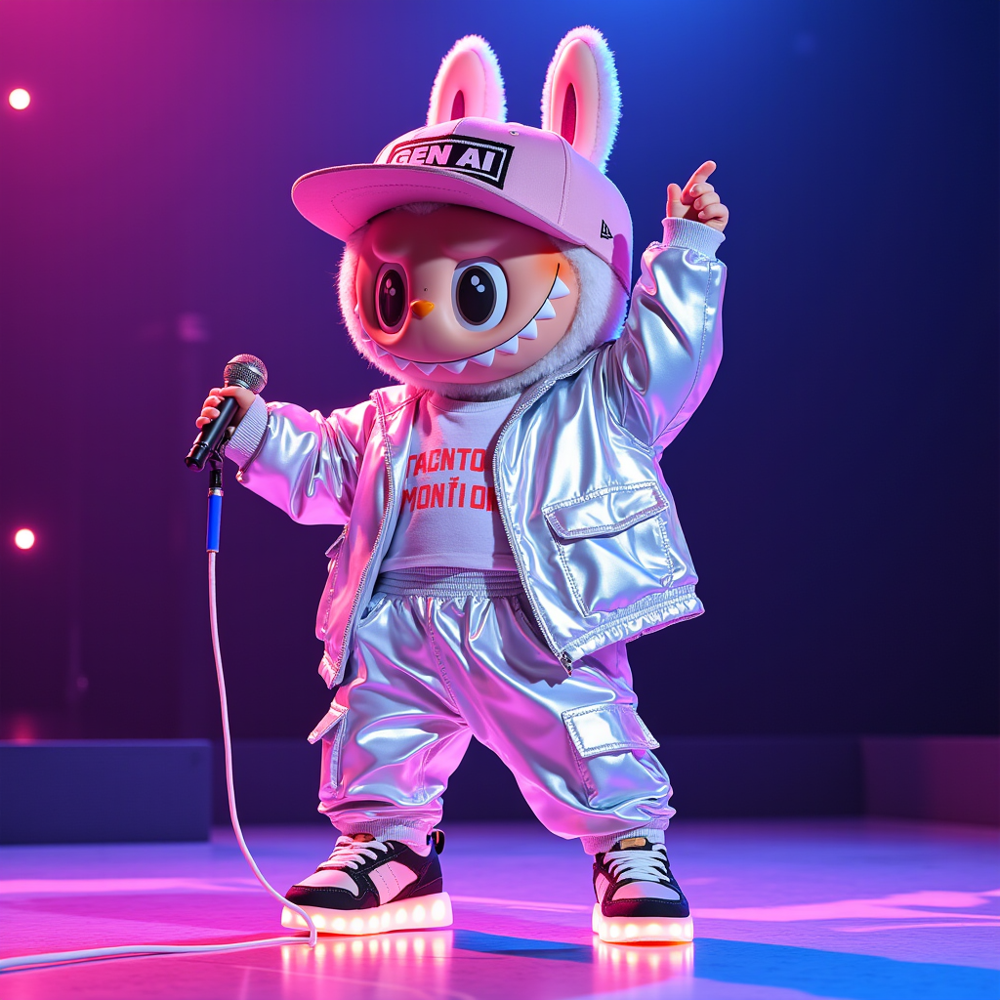
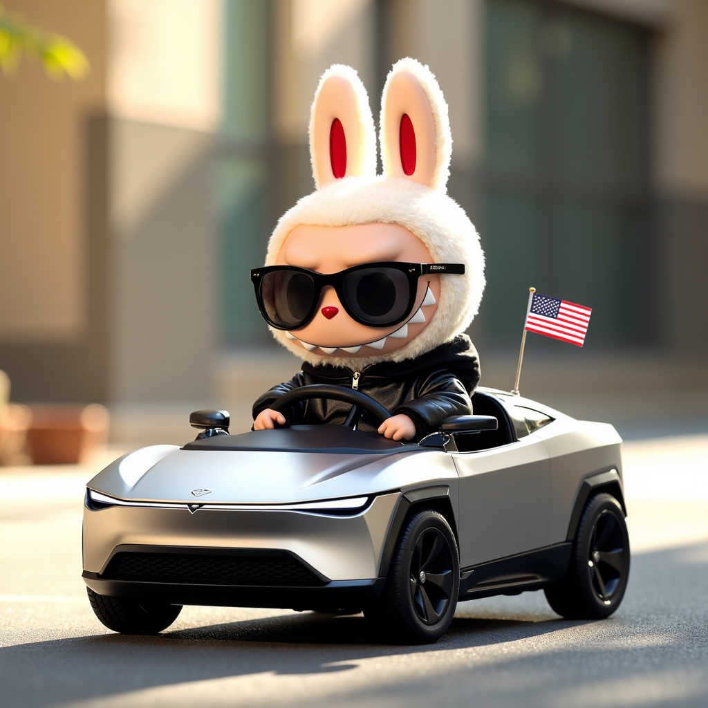

---
date: 2025-01-13
author:
 - me
comments: true
tags:
- diffusion
- AI
--- 

# Why Character Artists Are Embracing AI (And Why You Should Too)

## The Rapid Growth of the IP Character Market
The IP character market is rapidly growing, and we all know the character entertainment market is massive. According to [Overnight lines, mall fights and instant sellouts: Labubu toy mania comes to America](https://www.latimes.com/business/story/2024-11-05/labubu-craze#:~:text=Pop%20Mart%20reported%20record%20revenue,Southeast%20Asia%20and%20East%20Asia.)
Pop Mart reported record revenue of $638.5 million for the first half of 2024, a 62% increase over the same period a year earlier. Sales in its burgeoning North America segment totaled $24.9 million.

You’ve likely seen some of Pop Mart’s famous IP characters, such as Labubu, Molly, and Bobo & Coco. These IP characters are driving the creation of numerous derivatives, including toys, NFTs, avatars, digital twins, virtual pets, and 3D-printed artifacts.

<!-- more -->

## AI to Release Trapped Potential: Make Your Character IP Generate Its Full Value
As a character artist or IP creator, you've poured countless hours into perfecting your signature character, but your character's potential to generate income is severely limited by how quickly you can create new content.

**Reality**:

- Fans constantly demand fresh content featuring your character, but manually creating each variation takes hours
- Major licensing opportunities require extensive character assets that would take months to produce by hand
- Other creators are scaling their character businesses while you're stuck in the time-consuming loop of manual creation
- Potential revenue is slipping away because you can't keep up with market demands or new trend

But your character can now exist in infinite worlds, poses, and scenarios - without sacrificing your artistic vision or spending endless hours at the drawing board. Now with the help of AI, you can

- Generate hundreds of on-brand character variations in different styles and scenarios
- Create consistent merchandise-ready assets in minutes instead of days
- Scale your licensing potential by rapidly producing customized character content
- Maintain full creative control while dramatically increasing your output
- Add interactivity and emotional engagement, gamifying your IP characters

**This isn't about replacing your creativity - it's about amplifying it.** Your character could appear in any setting, wearing any outfit, with any expression - all while maintaining your signature style.

### Using Labubu as an Example: Generating Variations with Stable Diffusion Models

With its iconic and whimsical design, Labubu is the perfect subject for creating diverse variations. Using Stable Diffusion models, we can effortlessly produce multiple variations of it like below:

{ width=400 height=400 }

<small>**Prompt**: Vibrant, high-definition image of Labubu, the whimsical cartoon character, in an energetic dance pose, dressed in a futuristic streetwear ensemble. They're wearing an oversized holographic bomber jacket with iridescent reflections, a cropped white t-shirt underneath with binary code patterns, and baggy cargo pants with multiple neon-accented pockets. Their signature snapback cap with 'GEN AI' emblazoned across the front sits playfully tilted, working harmoniously with their bunny-like ears that peek out beneath. Neon-colored sneakers with glowing soles complete the look, matching their energetic dance moves. They're standing on their tiptoes, body swaying with dynamic movement, microphone gripped confidently in their small hands. Their signature round eyes sparkle with enthusiasm beneath the hat's brim. The character is captured mid-performance, with their expressive face showing pure joy. Their posture suggests movement and energy, with one arm raised high holding the microphone while the other arm is bent at their side. The lighting creates a stage-like atmosphere, highlighting the metallic and holographic elements of their outfit while casting a gentle glow on their features. Wearing Yeezy Foam Runner.</small>

{ width=400 height=400 }

<small>**Prompt**: Vibrant, high-definition image of Labubu, the whimsical cartoon character, coolly piloting a miniaturized Tesla Cybertruck scaled to their size. They're sporting sleek black aviator sunglasses that add an extra layer of attitude while perfectly framing their signature round eyes beneath the dark lenses. A black leather jacket completes their cool aesthetic, creating a striking contrast with their playful features. Their characteristic bunny ears just graze the angular roof of the tiny vehicle, which stands about three Labubus tall. The micro Cybertruck maintains all of Tesla's iconic design elements: the sharp-edged stainless steel exoskeleton, triangular roof profile, and continuous LED light bar, all adorably miniaturized. Inside the angular cabin, Labubu sits confidently at the minimal dashboard, one hand on the steering yoke while the other waves a small American flag out of the geometric window. The sunlight plays dramatically off both the Cybertruck's metallic exterior and Labubu's sunglasses, creating an interplay of reflections that emphasizes their cool, confident demeanor. The leather jacket adds a sophisticated sheen, completing the image of a tiny, stylish maverick at the wheel of their futuristic ride.</small>

#### How to do it

We use [ComfyUI](https://github.com/comfyanonymous/ComfyUI), a node-based interface designed for working with diffusion models, and the popular [Flux dev](https://blackforestlabs.ai/ultra-home/#get-flux) model. However, the Flux model does not inherently recognize concepts like Labubu or your IP character. To incorporate this information into the model, we utilize a technique known as LoRA.

Think of a model as a machine with numerous knobs. LoRA allows us to adjust only a small subset of these knobs, rather than fine-tuning the entire diffusion model (which is computationally expensive). This approach focuses on teaching the model specifically how our character looks. However, this step typically requires the most manual effort without automation tools. For more technically inclined readers, I recommend using [FluxGym](https://pinokio.computer/item?uri=https://github.com/cocktailpeanut/fluxgym) for fine-tuning. Additionally, you can find a helpful [tutorial](https://civitai.com/articles/7483/civitais-trainer-a-simple-beginners-guide-on-training-character-lora-using-it
) on creating LoRA on Civitai.

Once the LoRA checkpoint is ready, you can use this workflow below (download the image and drag it into ComfyUI directly) to generate custom versions of your character with prompts. You can create multi-view representations of the character and even 3D models. Please note that custom nodes (e.g. ComfyUI-Easy-Use, ComfyUI-MVAdapter) must be installed to successfully run the workflow.

## ✨ Want to learn more about this topic? ✨
I'm available for free consultations, contract work, or commission projects. 💼
Shoot me an email: hu.niel92@gmail.com

[Subscribe to my newsletter](https://nielhu.kit.com/6a15d65fb4){: .secondary-button} or [Schedule a call](https://cal.com/niel-hu-d18f1z/30min){: .primary-button} to connect!
