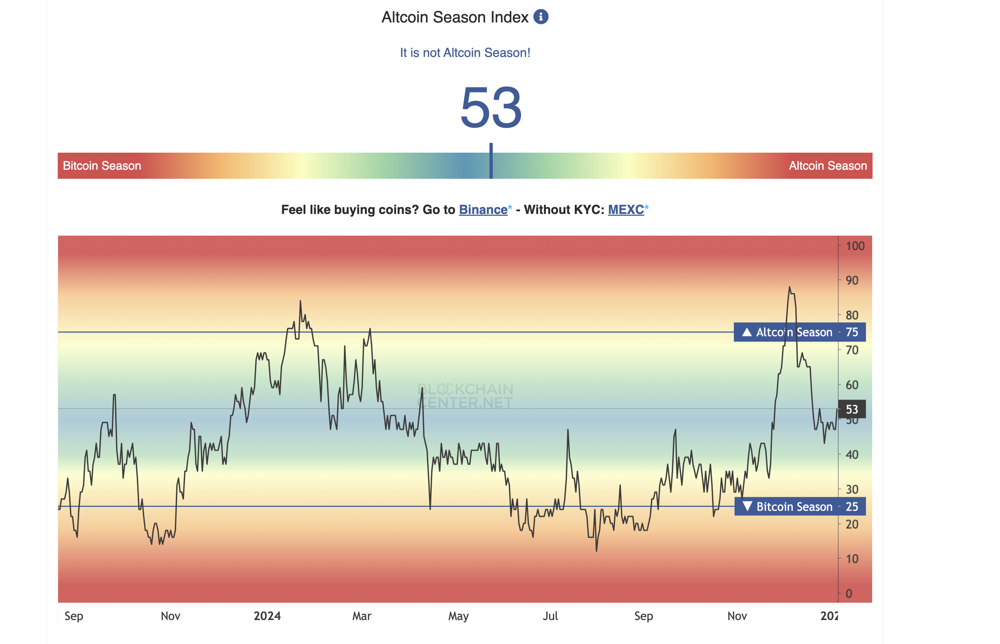

---
date: 2025-01-03
author:
 - me
--- 

Wealth redistribution in bubbles and crashes 
======================================================

[This paper](https://www.sciencedirect.com/science/article/abs/pii/S0304393222000137) analyzed China's 2014-2015 stock market bubble, where rich investors made bank while smaller investors got burned.  The top 0.5% of investors pocketed 250 billion RMB, while 85% of smaller investors lost about 30% of their money. Wealth transfer from those who need it to those who don't. 

Three key patterns that feel similar to today's crypto market:
Small investors were too cautious early in the bull run. They kept waiting and waiting, only jumping in when prices were already sky-high. The poorest investors actually pulled money out during the early bull market - big mistake.
Mid-tier investors couldn't cut their losses. While the whales quickly dumped when prices started falling, smaller investors hesitated, sometimes even buying more to "catch the falling knife."
Once small investors finally jumped in, they went straight for the riskiest assets hoping to get rich quick. Usually ended up holding the bag.

Looking at March 2024, we're seeing similar signs - zombie coins coming back to life, alt-coin indexes pumping... signs of retail FOMO.

Two key takeaways: 1. Don't chase pumps 2. Stay away from alt-coins

